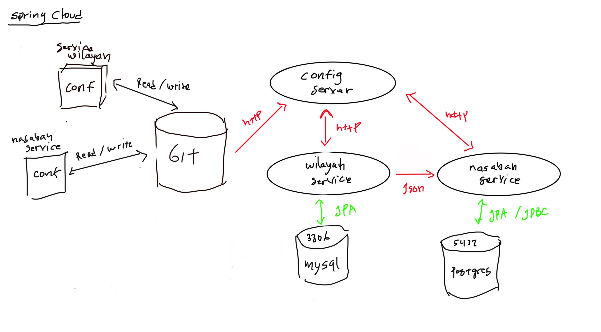
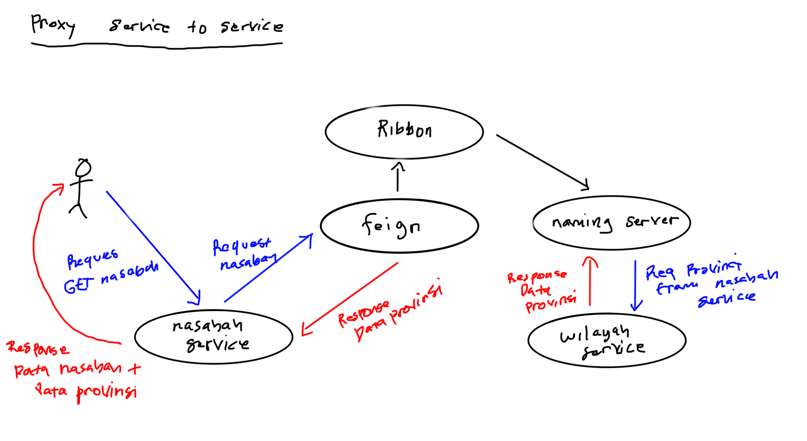

# Spring Cloud Example

Belajar spring-cloud for microservice architecture.

## Architecture `spring-cloud`



**Configuring runtime**

|   application name    | the ports binding                                         |
| :--------             | :-------                                                  |
| config-server         | [localhost:8888](http://localhost:8888)                   |
| sample-service        | [localhost:8080](http://localhost:8080)                   |
| wilayah-service       | [localhost:7000,7001...](http://localhost:6000)           |
| nasabah-service       | [localhost:6000,6001,6002...](http://localhost:6000)      |
| eureka-naming-server  | [localhost:8671](http://localhost:8671)                   |
| zuul api-gateway      | [localhost:8765](http://localhost:8765)

## Proxy with feign & ribbon

Berikut flow proxy dari service nasabah ke service wilayah: 



Biasya kalau kita call rest-api harus menanamkan url contohnya `http://localhost:8080/api/**` atau lain-lain. Nah itu hanya bekerja klo untuk satu service aja kalo ada ratusan service ??? how we can do that?

Dengan menggunakan fitur `spring-cloud-starter-netflix-eureka-server` kita bisa membuat proxy dengan multiple instance, kemudian untuk memanggil rest dengan menggunakan `spring-cloud-starter-openfeign`, `spring-cloud-starter-netflix-ribbon` dan `spring-cloud-starter-netflix-eureka-client` kita tidak perlu meng-hardcode lagi url tetapi hanya dengan menggunakan memanggilnya melalu ${spring.application.name} contoh implementasi di nasabah service seperti berikut:

```java
@FeignClient(name = "wilayah-service")
@RibbonClient("wilayah-service")
public interface WilayahProxy {

    @GetMapping("/provinsi/{id}")
    ResponseEntity<Provinsi> provinsiById(@PathVariable("id") Long provinsiId);
}
```

Akan secara langsung di forward ke service wilayah.

## Api gateway with `netflix-zuul`

Berikut ini flow api gateway berdasarkan gambar dibawah ini:


**Schenario 1**

request: GET [localhost:8765/nasabah_service/perorangan/10](http://localhost:8765/nasabah_service/perorangan/10)

1. Zuul `api gateway` catch request dari browser, kemudian di-forward ke `eureka naming server` untuk mencari nama service atau application name yang di register ke eureka.
2. `eureka` forward request ke [localhost:7000/perorangan/10](http://localhost:7000/perorangan/10) berdasarkan application name yaitu `nasabah_service`.
3. Di dalam nasabah service, memanggil service lain yaitu `wilayah_service` dengan menggunakan proxy `feign client` yang mereference ke service `wilayah_service` seperti berikut penggalan codenya:

    ```java
    @FeignClient(name = "api-gateway-zuul")
    @RibbonClient(name = "wilayah-service")
    public interface WilayahProxy {
    
        @GetMapping("/wilayah-service/provinsi/{id}")
        ResponseEntity<Provinsi> provinsiById(@PathVariable("id") Long provinsiId);
    }
    ```
4. `feign client` melakukan check status dengan menggunakan `spring-boot-starter-actuator` jika status `UP` maka akan di arahkan ke service tersebut berdasarkan application name `wilayah_service`.
5. Karena instance `wilayah_service` ada 2 service yang berjalan yaitu di port [6000](http://localhost:6000/provinsi/32) dan [6001](http://localhost:6001/provinsi/32). Maka `api gateway` akan memilih route berdasarkan algoritmanya. Contohnya app yang di forward yaitu port 6001 maka di forward ke path [localhost:6001/provinsi/32](http://localhost:6001/provinsi/32)
6. Response dikirim kembali ke `feign client` berikut repsonse:
    ```json
    {
     "id": 32,
     "name" : "Jawa Barat"
    }
    ```
7. Menerima response berupa json
8. forward data nasabah + data provinsi ke `eureka naming server`
9. forward data nasabah + data provinsi ke `api-gateway`
10. Browser mendirima data nasabah seperti berikut:
    ```json
    {
      "id": 10,
      "provinsiTinggal": {
          "id": 32,
          "name" : "Jawa Barat"
      }, 
      "namaLengkap": "Dimas Maryanto"
    }
    ```
